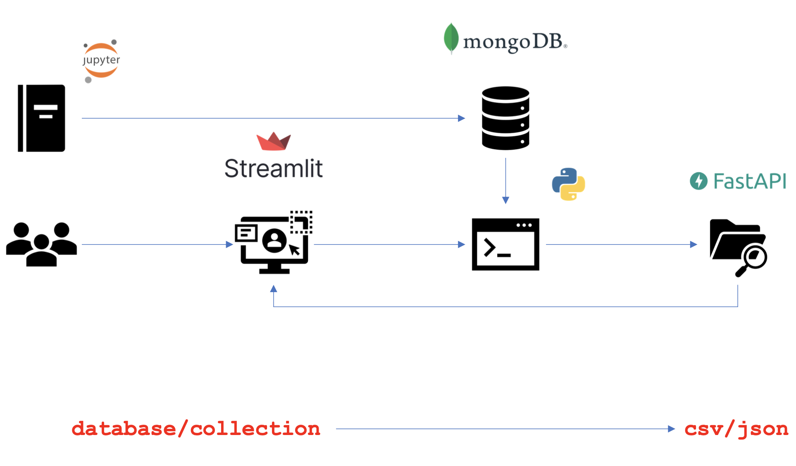
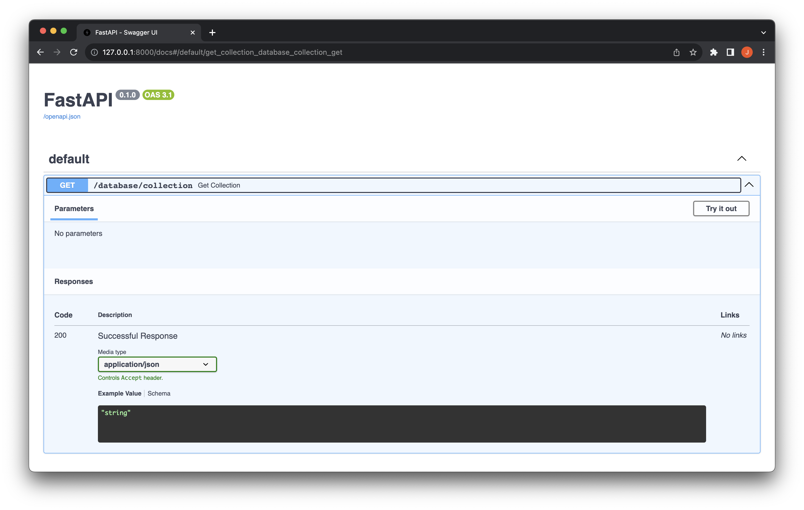

# free-the-datos

This is my final project of the Ironhack data analytics bootcamp and consists of creating an API to serve scraped data from the Internet to users. The main motivation of the project is perfectly reflected in its motto:

> Imagine a world where you don't have to do data projects on the titanic, publications, weather or diamonds. You're welcome.

Throughout my bootcamp, one of the biggest challenges I have faced is finding a free database that would motivate me to develop a project on it. Obviously, there are some interesting databases out there, but they are scarce and that has led to multiple similar projects. If you wonder why all the free databases you find on the internet are always the same, the answer is simple: data has a price and companies don't give it away for free. Therefore, as a final project and also a personal project that I intend to maintain in the future, I have decided to put an end to the scarcity of interesting data and give away to the community all the data I can get.

## How it works?

The following flowchart represents in a simple way the operation of the API I have designed:

I have created a set of functions in jupyter notebooks that scrape different products from the internet and then feed Mongo databases sorted by collections. The frontend is built on top of Streamlit, from which the user selects the database collection to download and a python function fetches that data from Mongo. The obtained data is used to feed an API, which has a dynamic endpoint, which is defined from /database/collection that the user wants to download. The data is served in csv and json format downloadable from the Streamlit frontend.

Also, as a bonus, the Streamlit frontend has a section that shows you a quick EDA of the available data of your choice.

#### Tools
- [Selenium](https://www.selenium.dev/)
- [BeautifulSoup](https://pypi.org/project/beautifulsoup4/)
- [MongoDB](https://www.mongodb.com/)
- [FastAPI](https://fastapi.tiangolo.com/)
- [Streamlit](https://streamlit.io/)